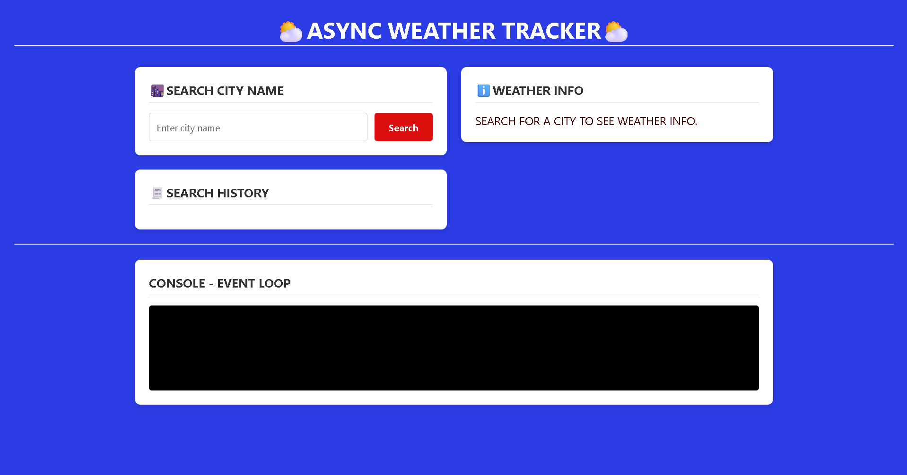

# ⛅ ASYNC WEATHER TRACKER

A responsive web application that tracks real-time weather data while demonstrating asynchronous JavaScript execution and Event Loop logging.

---

## 📸 Interface Preview

Below is the UI of the application:


---

## 🛠️ Features

- **City Search**  
  Enter any city name to fetch live weather data.

- **Search History**  
  Keeps track of previously searched cities.

- **Weather Display**  
  Shows temperature, conditions, and other details dynamically.

- **Event Loop Console**  
  Visualizes asynchronous JavaScript execution and logs event loop activity.

---

## 📂 Project Structure

| File        | Description |
|------------|------------|
| `index.html` | Main structure of the app |
| `style.css`  | UI styling (blue theme + cards) |
| `script.js`  | Handles API calls & async logic |

---

## 🚀 How to Run

1. Clone the repository:
   ```bash
   git clone https://github.com/your-username/async-weather-tracker.git
   ```

2. Navigate into the project folder:
   ```bash
   cd async-weather-tracker
   ```

3. Make sure your screenshot file is in the root folder:
   ```
   Screenshot 2026-05-05 151905.png
   ```

4. Open:
   ```
   index.html
   ```
   in your browser.

---

## 💡 Tech Used

- HTML5  
- CSS3  
- JavaScript (Async / Await, Fetch API)  

---

## 📌 Notes

- Ensure internet connection for API calls.
- You can enhance it by adding:
  - Loader animations  
  - Error handling UI  
  - Dark mode  

---

✨ *Developed as a demonstration of Asynchronous JavaScript and Event Loop behavior.*
